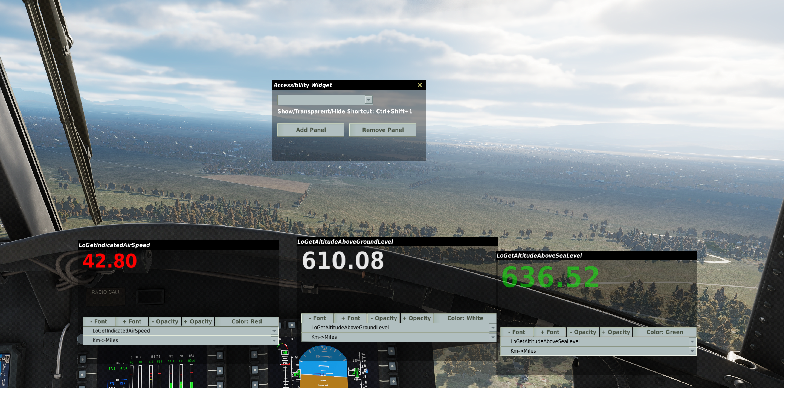
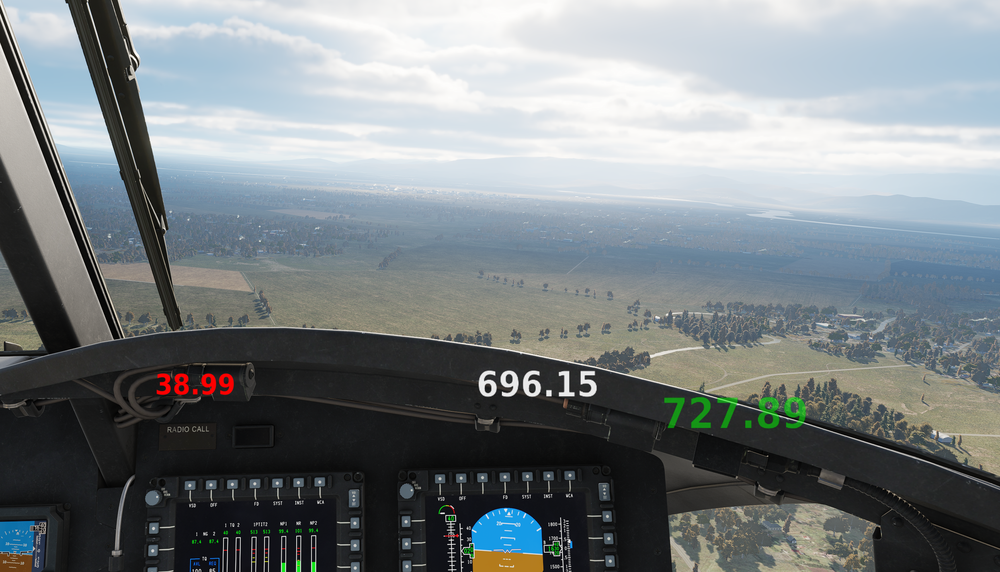

# DCS AccMod

Advanced modular window system for DCS World with instrument data display, MFD rendering, and VR overlay support.

## Features

### Core Features
- **Modular Widgets:** Create customizable windows displaying instrument data
- **Data Export:** Shows exported values from DCS aircraft systems
- **Adjustable UI:** Font size, opacity, and positioning controls
- **Hotkey Support:** Ctrl+Shift+1 toggles visibility modes
- **VR Mode:** Overlay widgets in VR headsets via OpenXR layer

### 🆕 MFD Rendering (In Development)
- **Virtual Monitor Capture:** Renders DCS MFDs to virtual displays
- **Multi-Display Support:** Capture Left/Right/Center MFDs simultaneously
- **Window Mode:** Display MFDs in resizable widgets
- **VR Overlay:** Show MFDs as floating quads in VR space
- **Performance Optimized:** GPU-direct capture with minimal overhead

## Installation

### Basic Installation
1. Extract mod files to DCS Saved Games folder: `%USERPROFILE%\Saved Games\DCS`
2. Or run `install.bat` from the distribution

### MFD Rendering Setup (Optional)
For advanced MFD capture and display:

```powershell
# Run automated setup as Administrator
.\setup-mfd-system.ps1
```

See [MFD_SETUP_GUIDE.md](mfd/MFD_SETUP_GUIDE.md) for detailed instructions.

## Usage

### Basic Widget System
1. Launch DCS and enter aircraft
2. Main window appears automatically
3. Add/remove subpanels as needed
4. Select data values from dropdown
5. Adjust font size and opacity when fully visible
6. Press **Ctrl+Shift+1** to cycle: Full → Instrument Only → Hidden

### MFD Capture (Beta)
1. Complete MFD setup (see guide)
2. Press **Ctrl+Shift+A** for AccMod manager
3. Enable "MFD Capture"
4. Select MFDs to display
5. Position and resize as needed

## Building from Source

### Prerequisites
- Visual Studio 2022
- CMake 3.15+
- Windows 10/11 SDK

### Build Commands
```powershell
# Build all components
.\build-all.bat

# Deploy to DCS
.\deploy.bat

# Build MFD capture module only
cd native\MFDCapture
.\build.bat
```

## Documentation

- [MFD Setup Guide](mfd/MFD_SETUP_GUIDE.md) - Complete MFD rendering setup
- [MFD Quick Reference](mfd/MFD_QUICK_REFERENCE.md) - One-page setup cheat sheet
- [MFD Implementation Progress](mfd/MFD_IMPLEMENTATION_PROGRESS.md) - Development status
- [MFD Rendering Plan](mfd/MFD_RENDERING_PLAN.md) - Technical architecture
- [Chatbot Memory Hub](../memory/README.md) - AI agent bootstrap, mission map, pitfalls, and doc index

## Supported Aircraft (MFD Rendering)

| Aircraft | MFDs | Status |
|----------|------|--------|
| F/A-18C Hornet | L/R MFCD, AMPCD | ⏳ Testing |
| F-16C Viper | L/R MFD | ⏳ Testing |
| A-10C Warthog | L/R MFCD | ⏳ Testing |
| AH-64D Apache | 4x MPD | 🔄 Planned |

## Credits

- Original widget system inspired by DCS SRS plugin
- [Virtual Display Driver](https://github.com/VirtualDrivers/Virtual-Display-Driver) for virtual monitor support
- Microsoft Desktop Duplication API for screen capture
- OpenXR for VR overlay capabilities



